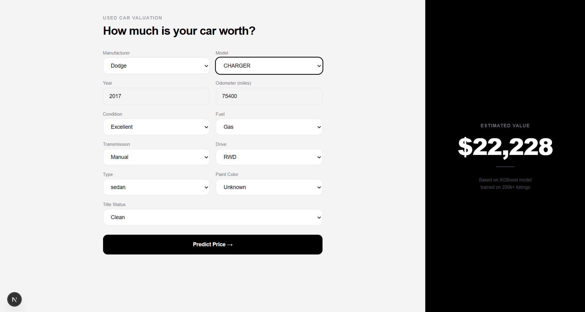
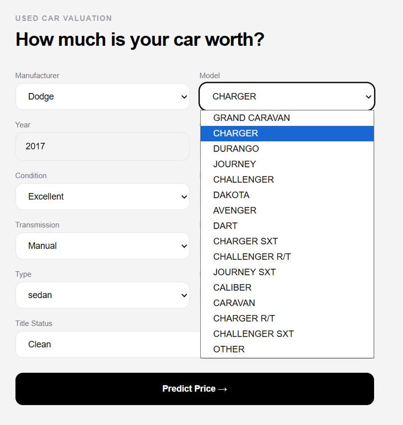

# Car Price Predictor — UI

Next.js frontend for a machine learning car price prediction model. Enter vehicle details and get an instant price estimate powered by an XGBoost model trained on 200,000+ real listings.

## Screenshots




## Tech Stack

- **Next.js 14** — App Router
- **TypeScript**
- **Tailwind CSS**
- **FastAPI** — Python backend (separate repo)

## How It Works

1. User selects vehicle details (manufacturer, model, year, mileage, condition...)
2. Form sends a POST request to the FastAPI backend
3. Backend runs the XGBoost model and returns a predicted price
4. Price is displayed in real time on the right panel

## Getting Started

Clone the repo and install dependencies:

```bash
npm install
npm run dev
```

Open [http://localhost:3000](http://localhost:3000).

> **Note:** Requires the FastAPI backend running locally on `http://127.0.0.1:8000`. See the [ML repo](https://github.com/VujevicStipe/car-price-predictor-ml) for setup instructions.

## Project Structure

```
app/
  page.tsx              # Main layout — split view
  components/
    CarForm.tsx         # Form with dynamic model filtering
  lib/
    constants.ts        # All dropdown options + manufacturer→model mapping
    api.ts              # Fetch helper for FastAPI
```

## Features

- Dynamic model dropdown — models filter based on selected manufacturer
- Split layout — form on the left, live result on the right
- Loading spinner while waiting for prediction
- No page refresh needed

## ML Model

The prediction is powered by an XGBoost regression model:
- **Dataset:** Craigslist Used Cars (Kaggle) — 426k listings
- **After cleaning:** ~211k listings
- **MAE:** ~$3,840
- **R²:** 0.749

Trained in Python with scikit-learn and XGBoost, served via FastAPI.